# Практическая работа №3. Обеспечение безопасности данных и управление уязвимостями в контейнеризированной среде

**Дисциплина:** Методы и средства защиты облачной и сетевой инфраструктуры · **Дата:** 07.10.2026

## Результаты

| Что проверялось | До исправления | После исправления |
|---|---|---|
| Уязвимости CRITICAL/HIGH в образе (Trivy) | **2 261** (227 CRITICAL, 2 034 HIGH) | **0** |
| Нарушения в манифесте Kubernetes (Checkov) | **19** | **1** (`CKV_K8S_43`, обоснованно пропущено) |
| Пайплайн GitHub Actions | ❌ сборка заблокирована | ✅ все проверки пройдены |
| GitHub Code scanning | 5 000 открытых оповещений | 0 открытых, 5 000 закрытых |

Главный вывод: **98,6 % уязвимостей приходилось на базовый образ `node:18`**, а не на код приложения. Наибольший эффект дали переход на `node:22-alpine` и удаление npm из рантайма. Обновление только express и lodash, как в методичке, устранило бы менее 0,5 % находок.

## Содержание

- [Окружение](#окружение)
- [Структура репозитория](#структура-репозитория)
- [Часть 1. Тестовое приложение](#часть-1-тестовое-приложение)
- [Часть 2. Сканирование образа с помощью Trivy](#часть-2-сканирование-образа-с-помощью-trivy)
- [Часть 3. Статический анализ IaC с помощью Checkov](#часть-3-статический-анализ-iac-с-помощью-checkov)
- [Часть 4. Управление ключами и шифрование с помощью GnuPG](#часть-4-управление-ключами-и-шифрование-с-помощью-gnupg)
- [Часть 5. Интеграция в CI/CD (GitHub Actions)](#часть-5-интеграция-в-cicd-github-actions)
- [Ответы на контрольные вопросы](#ответы-на-контрольные-вопросы)
- [Выводы](#выводы)

## Окружение

Работа выполнена на **macOS 26.5.1 (Apple Silicon, arm64)** вместо Ubuntu из методички, инструменты установлены через Homebrew.

| Инструмент | Версия | Назначение |
|---|---|---|
| Docker Desktop | 29.4.0 | Сборка контейнерных образов |
| Trivy | 0.75.0 | Поиск CVE в образе |
| Checkov | 3.3.20 | Статический анализ манифеста Kubernetes |
| GnuPG (+ pinentry-mac) | 2.5.24 | Генерация ключей, шифрование, ротация |
| git / GitHub CLI | 2.54.0 / 2.102.0 | Публикация репозитория, запуск GitHub Actions |

## Структура репозитория

```
.
├── .github/workflows/security-scan.yml   # CI: сборка + Trivy + Checkov + SARIF
├── Dockerfile, package.json, server.js   # текущая (исправленная) версия, её собирает CI
├── deployment.yaml                       # исправленный манифест Kubernetes
├── vulnerable/                           # версия "до": node:18, старые зависимости, privileged: true
├── secure/                               # версия "после" (копия корня)
├── run_scans.sh                          # части 2–3 одной командой, вывод в reports/
├── check_install.sh                      # проверка установленных инструментов
├── screenshots/                          # скриншоты для отчёта
└── INSTRUCTIONS_macOS.md                 # пошаговая инструкция по воспроизведению
```

Воспроизвести части 2–3: `bash run_scans.sh` (подробно — в [INSTRUCTIONS_macOS.md](INSTRUCTIONS_macOS.md)).

## Часть 1. Тестовое приложение

Минимальный HTTP-сервер на Express, отвечает «Hello, Security!» на порту 3000 ([`server.js`](server.js)).

| | Уязвимая версия ([`vulnerable/`](vulnerable)) | Исправленная версия ([`secure/`](secure)) |
|---|---|---|
| Базовый образ | `node:18` (Debian 12.11, поддержка Node 18 прекращена) | `node:22-alpine` (Alpine 3.24.2) |
| Зависимости | express 4.16.0, lodash 4.17.15 | express ^4.21.0, lodash ^4.17.21 |
| Пакеты ОС | без обновления | `apk upgrade` при сборке |
| npm / yarn / corepack в образе | есть | удалены после установки зависимостей |
| Пользователь | root | `node` |

<details>
<summary>Исправленный Dockerfile</summary>

```dockerfile
FROM node:22-alpine
WORKDIR /app

RUN apk upgrade --no-cache || echo "WARNING: apk upgrade пропущен (зеркало Alpine недоступно)"

COPY package*.json ./
RUN npm install --omit=dev \
 && npm cache clean --force \
 && rm -rf /usr/local/lib/node_modules/npm /usr/local/lib/node_modules/corepack \
           /usr/local/bin/npm /usr/local/bin/npx /usr/local/bin/corepack \
           /usr/local/bin/yarn /usr/local/bin/yarnpkg /opt/yarn-*

COPY server.js .
USER node
EXPOSE 3000
CMD ["node", "server.js"]
```
</details>

## Часть 2. Сканирование образа с помощью Trivy

```bash
docker build -t demo-app:vulnerable vulnerable/
trivy image demo-app:vulnerable
trivy image --severity CRITICAL,HIGH demo-app:vulnerable
trivy image --format json --output trivy-report.json demo-app:vulnerable
docker build -t demo-app:secure secure/
trivy image --severity CRITICAL,HIGH demo-app:secure
```

| Цель сканирования | До: всего (все уровни) | До: CRITICAL | До: HIGH | После: CRITICAL + HIGH |
|---|---:|---:|---:|---:|
| Пакеты ОС (Debian 12.11 → Alpine 3.24.2) | 10 665 | 226 | 2 003 | 0 |
| npm: зависимости приложения (`/app/node_modules`) | — | 0 | 9 | 0 |
| npm: библиотеки внутри самого npm | — | 1 | 22 | 0 (npm удалён) |
| **Итого** | **10 723** | **227** | **2 034** | **0** |

**Анализ находок до исправления:**

- **Базовый образ.** Полный `node:18` содержит 232 уязвимых пакета ОС и 6 981 уникальную CVE. Больше всего находок в `linux-libc-dev` (840 CRITICAL/HIGH), затем ImageMagick и Perl — инструменты сборки, которые приложению не нужны.
- **Устаревание.** Для 1 746 из 2 229 находок CRITICAL/HIGH в ОС исправление уже выпущено: образ просто не обновлялся.
- **Зависимости приложения (9 HIGH):**
  - lodash 4.17.15: CVE-2021-23337 (внедрение команд через `template`), CVE-2020-8203 (prototype pollution);
  - qs 6.5.1: CVE-2022-24999 (prototype poisoning);
  - path-to-regexp 0.1.7: CVE-2024-45296 (ReDoS);
  - body-parser 1.18.2: CVE-2024-45590 (DoS).

  Уязвимые qs, path-to-regexp и body-parser подтянуты транзитивно через express 4.16.0.
- **Библиотеки npm (23).** Единственная CRITICAL — `tar` 6.2.1 внутри npm (CVE-2026-59873). Ещё 8 HIGH в том же `tar` позволяют перезапись файлов через path traversal. npm нужен только при сборке, поэтому удалён из финального образа.

После исправления Trivy пометил как «Clean» образ `demo-app:secure (alpine 3.24.2)` и каждый пакет в `app/node_modules`.

## Часть 3. Статический анализ IaC с помощью Checkov

```bash
checkov -f vulnerable/deployment.yaml --framework kubernetes   # до:    Passed 69, Failed 19
checkov -f secure/deployment.yaml --framework kubernetes       # после: Passed 87, Failed 1
```

Исправление из методички закрывает лишь часть проверок, поэтому манифест доработан. Неточность методички: `CKV_K8S_8` — проверка livenessProbe, а `readOnlyRootFilesystem` проверяет `CKV_K8S_22`.

| Проверка | Что требует | Исправление | После |
|---|---|---|---|
| CKV_K8S_16 | Не запускать привилегированный контейнер | `privileged: false` | ✅ |
| CKV_K8S_20 | Запрет повышения привилегий | `allowPrivilegeEscalation: false` | ✅ |
| CKV_K8S_23 | Не запускать от root | `runAsNonRoot: true` | ✅ |
| CKV_K8S_40 | Высокий UID | `runAsUser: 10001` | ✅ |
| CKV_K8S_22 | ФС только для чтения | `readOnlyRootFilesystem: true` | ✅ |
| CKV_K8S_37, CKV_K8S_28 | Сброс capabilities, в т.ч. NET_RAW | `capabilities: drop: ["ALL"]` | ✅ |
| CKV_K8S_31 | Профиль seccomp | `seccompProfile: RuntimeDefault` | ✅ |
| CKV_K8S_29 | securityContext пода | `spec.securityContext` | ✅ |
| CKV_K8S_38 | Не монтировать токен ServiceAccount | `automountServiceAccountToken: false` | ✅ |
| CKV_K8S_10, 11, 12, 13 | Запросы и лимиты CPU/памяти | requests 100m/128Mi, limits 500m/256Mi | ✅ |
| CKV_K8S_8, CKV_K8S_9 | Liveness- и readiness-пробы | `httpGet /` на порт 3000 | ✅ |
| CKV_K8S_15 | Всегда скачивать образ | `imagePullPolicy: Always` | ✅ |
| CKV_K8S_21 | Не использовать namespace default | `namespace: demo` | ✅ |
| CKV_K8S_43 | Образ по digest | Неприменимо: образ не публикуется в реестр | ⚠️ пропущена в CI |

Дополнительно добавлена **NetworkPolicy**, разрешающая только входящий трафик на порт 3000. Её требует проверка `CKV2_K8S_6` в более новых версиях Checkov. Итоговый манифест — [`deployment.yaml`](deployment.yaml).

## Часть 4. Управление ключами и шифрование с помощью GnuPG

Файл с секретом зашифрован ключом RSA-4096, расшифрован без потерь и перешифрован новым ключом — так смоделирована ротация ключа в KMS.

| Ключ | Пользователь | Алгоритм | Подключ шифрования | Срок действия |
|---|---|---|---|---|
| Исходный | Security Lab (randomcomment) &lt;lab@example.com&gt; | RSA 4096 | 0C3B2F97C8DB8719 | 1 год, до 07.10.2027 |
| Новый (ротация) | Security Lab (new) &lt;new-lab@example.com&gt; | RSA 4096 | E135EB18D4B3BAD7 | 10 дней, до 17.10.2026 |

**4.1. Генерация ключевой пары** (RSA and RSA, 4096 бит, срок 1 год, пароль через pinentry-mac):

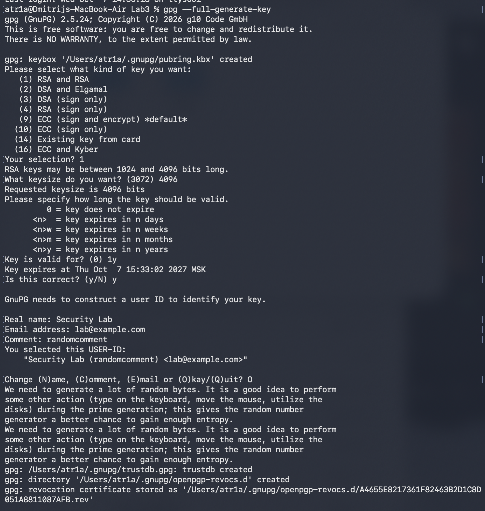

**4.2. Просмотр ключей.** Основной ключ имеет назначение [SC] (подпись и сертификация), подключ — [E] (шифрование):

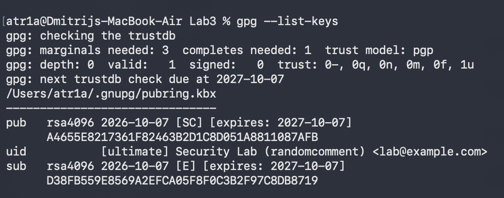
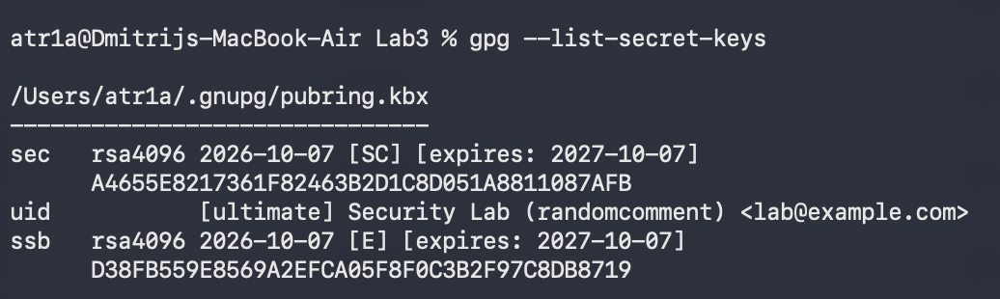

**4.3. Шифрование.** Исходный `secrets.txt` удалён, `secrets.txt.gpg` (633 байта) без закрытого ключа нечитаем. На macOS нет `shred`, поэтому файл удалён командой `rm`:

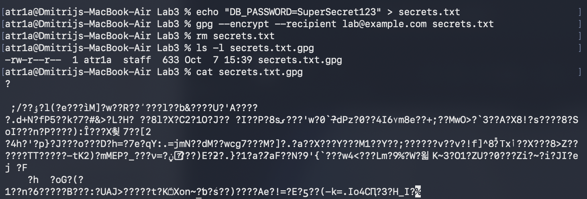

**4.4. Расшифровка:**

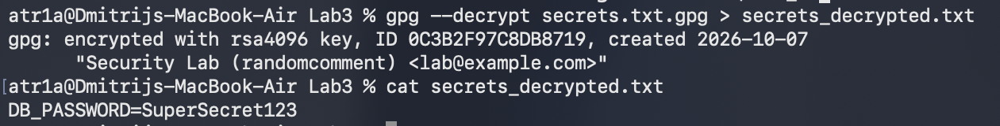

**4.5. Ротация ключа.** Создан новый ключ, данные расшифрованы старым ключом и сразу зашифрованы новым через конвейер, без записи открытого текста на диск. `secrets_new.gpg` расшифровывается подключом нового ключа:

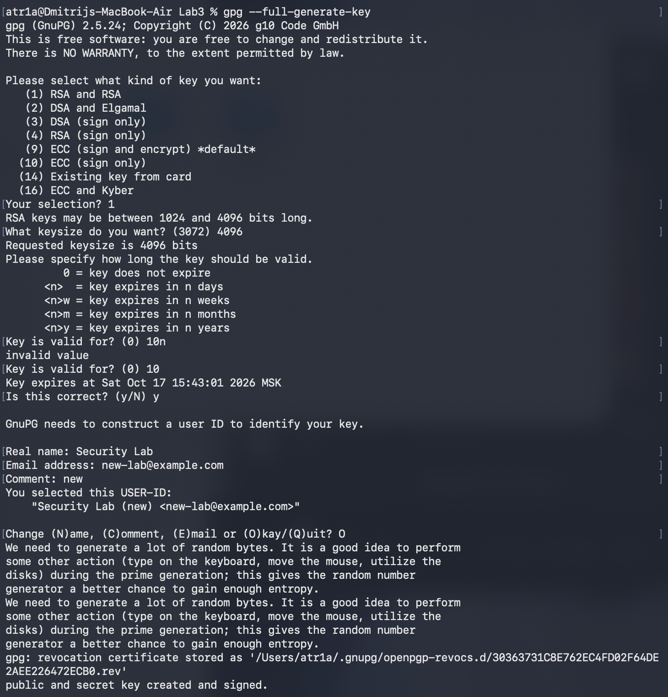
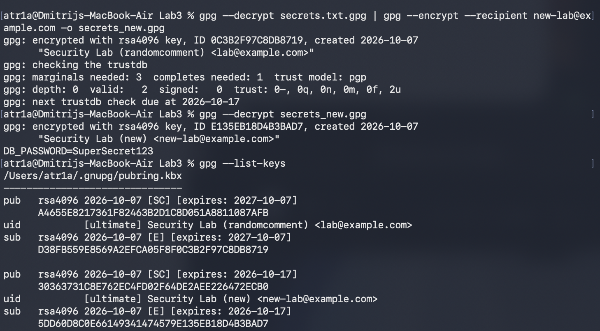

> `secrets*.txt` и `*.gpg` исключены из репозитория через `.gitignore`. Значение `SuperSecret123` — учебное.

## Часть 5. Интеграция в CI/CD (GitHub Actions)

Workflow: [`.github/workflows/security-scan.yml`](.github/workflows/security-scan.yml). По сравнению с методичкой добавлены:

- права `security-events: write` — без них не загрузится SARIF;
- шаг установки Checkov — на раннере его нет;
- `if: always()` для шагов после Trivy;
- `ignore-unfixed: true`;
- пропуск `CKV_K8S_43`.

| Запуск | Коммит | Результат | Время | Упавшие шаги |
|---|---|---|---|---|
| #2 | Fix vulnerabilities: update base image, deps, harden manifest | ✅ успех | 1 мин 16 с | — |
| #1 | Vulnerable version | ❌ провал | 1 мин 35 с | Trivy Image Scan, Checkov IaC Scan |

**Запуск #1 — уязвимая версия, сборка заблокирована (security gate):**

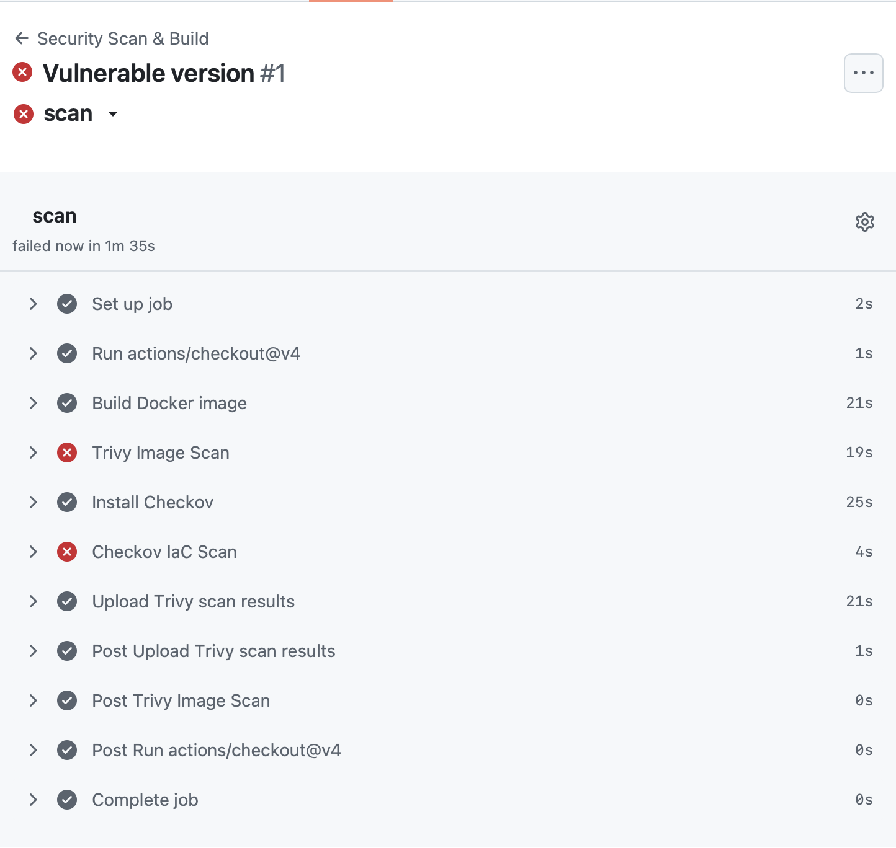
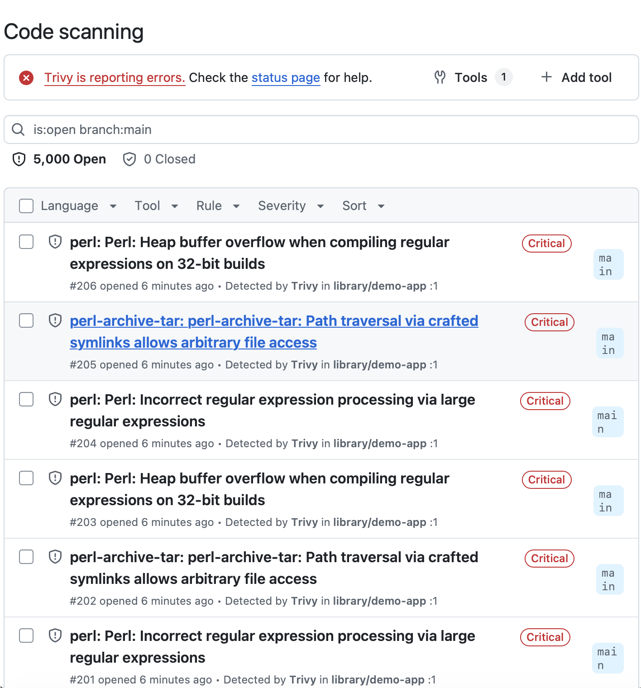

5 000 — это предел отображения результатов из одной загрузки SARIF, а не точное число находок. SARIF-отчёт trivy-action по умолчанию включает все уровни критичности; локально их было 10 723.

**Запуск #2 — исправленная версия, все проверки пройдены, оповещения закрыты автоматически:**

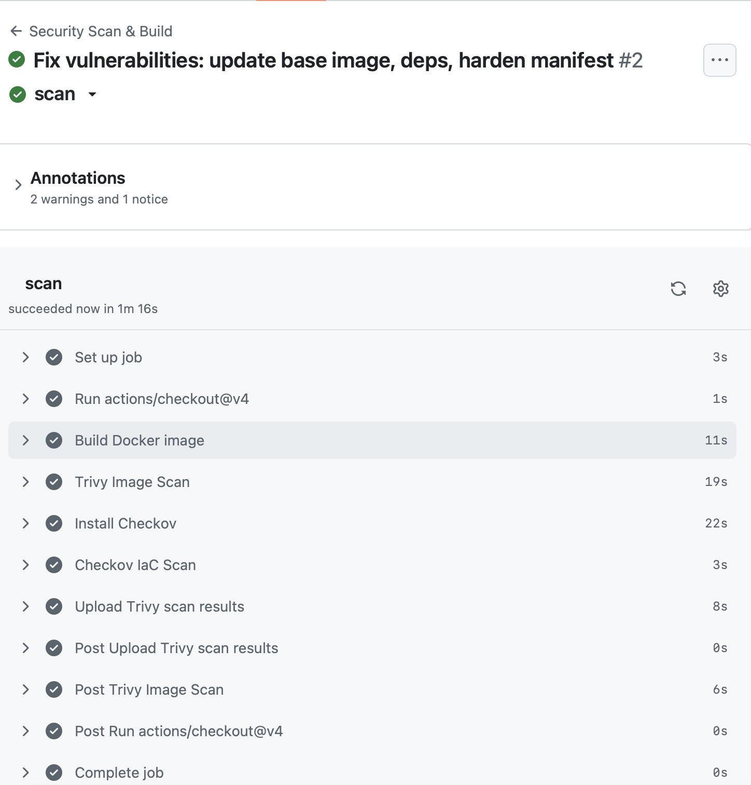
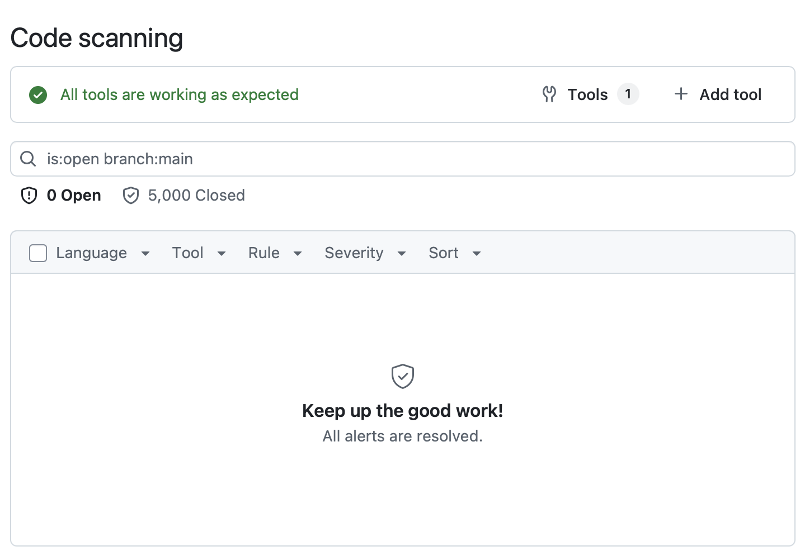

## Ответы на контрольные вопросы

<details>
<summary><b>1. Чем отличается сканирование файловой системы (<code>trivy fs</code>) от сканирования образа (<code>trivy image</code>)?</b></summary>

**`trivy fs`** анализирует каталог на диске:
- исходный код и манифесты;
- lock-файлы зависимостей (`package-lock.json`, `requirements.txt`);
- секреты и ошибки конфигурации.

Он запускается до сборки и даёт самую раннюю обратную связь.

**`trivy image`** анализирует готовый артефакт по слоям: пакеты ОС базового образа и фактически установленные библиотеки.

В этой работе 2 252 из 2 261 находки CRITICAL/HIGH (99,6 %) были в пакетах ОС и внутри npm. `trivy fs` по исходникам их бы не увидел.
</details>

<details>
<summary><b>2. Почему Trivy и Checkov дополняют друг друга? В каких сценариях нужен каждый из них?</b></summary>

Инструменты отвечают на разные вопросы:
- **Trivy** — «что внутри артефакта»: известные CVE в пакетах и библиотеках.
- **Checkov** — «как артефакт будет развёрнут»: ошибки конфигурации в Kubernetes, Terraform, CloudFormation, Dockerfile.

Образ без единой CVE, запущенный с `privileged: true`, всё равно даёт атакующему выход на хост — и наоборот.

**Когда нужен Trivy:**
- при сборке;
- перед публикацией образа в реестр;
- для регулярного пересканирования развёрнутых образов: новые CVE появляются ежедневно.

**Когда нужен Checkov:** при каждом изменении инфраструктурного кода, до `kubectl apply` или `terraform apply`.
</details>

<details>
<summary><b>3. Какие принципы Zero Trust реализуются при использовании S3 Object Lock (или его аналогов)?</b></summary>

Object Lock реализует модель WORM (write once, read many). В режиме Compliance объект нельзя удалить или перезаписать до истечения срока хранения никому, включая root-аккаунт.

Принципы Zero Trust, которые это реализует:
- **«Предполагай компрометацию».** Даже украденные административные учётные данные не позволят уничтожить данные.
- **«Не доверять никому по умолчанию».** Права на удаление ограничены самим хранилищем, а не только политиками IAM.
- **Целостность данных.**

На практике это защита бэкапов и журналов аудита от шифровальщиков и заметания следов. Аналоги: Azure Immutable Blob Storage, GCS Bucket Lock.
</details>

<details>
<summary><b>4. Как автоматическая ротация ключей KMS снижает риски компрометации?</b></summary>

Ротация ограничивает ущерб от утечки ключа:
- скомпрометированный ключ раскрывает только данные, зашифрованные в его период действия;
- на одном ключе накапливается меньше шифротекста, который можно использовать для криптоанализа.

**Почему автоматическая.** Ротация не зависит от того, что кто-то забудет или отложит смену ключа. Она проходит незаметно для приложений: KMS хранит старые версии ключа для расшифровки старых данных и шифрует новые данные новой версией. Это соответствует требованиям PCI DSS, ISO 27001 и NIST SP 800-57 к ограниченному сроку жизни ключа.

В части 4 этот процесс выполнен вручную: расшифровка старым ключом и перешифрование новым.
</details>

<details>
<summary><b>5. Почему шифрование данных без управления ключами не является полноценной защитой?</b></summary>

Шифр защищает данные не лучше, чем защищён ключ. Злоумышленник, получивший доступ к данным, получит и ключ, если ключ:
- хранится рядом с данными или в коде;
- не имеет контроля доступа и аудита;
- никогда не меняется и не может быть отозван.

Полноценная защита охватывает весь жизненный цикл ключа:
- безопасная генерация;
- хранение отдельно от данных (KMS/HSM);
- разграничение доступа;
- журналирование использования;
- ротация и отзыв;
- резервное копирование.

Потерять ключ без резервной копии — значит потерять данные.
</details>

## Выводы

В работе реализован полный цикл DevSecOps «обнаружили → исправили → проверили» для образа, инфраструктурного кода и данных. Проверки встроены в CI/CD как security gate.

**Освоенные методы:**
- сканирование образов на CVE и приоритизация по критичности (Trivy): 2 261 → 0 находок CRITICAL/HIGH;
- статический анализ манифестов Kubernetes и принцип наименьших привилегий (Checkov): 19 → 1 нарушение;
- асимметричное шифрование и ротация ключей (GnuPG, RSA-4096) как модель облачного KMS;
- автоматическая блокировка небезопасной сборки в GitHub Actions и публикация результатов в GitHub Code scanning (SARIF).

**Трудности и решения:**

| Трудность | Решение |
|---|---|
| Сбои сети при загрузке с ghcr.io (`HTTP2 framing layer`) при установке пакетов Homebrew | HTTP/1.1 для curl (`~/.curlrc`, `HOMEBREW_CURLRC=1`) |
| Зеркало Alpine недоступно из Docker, сборка падала на `apk upgrade` | Шаг вынесен отдельно и сделан нефатальным; в CI выполняется полностью |
| Команды методички рассчитаны на Ubuntu (`apt-key`, `shred`) | Установка через Homebrew; `rm` вместо `shred` |
| В исходном workflow нет установки Checkov и права `security-events: write` | Добавлены шаг `pip install checkov` и блок `permissions` |
| Исправление манифеста по методичке оставляет большинство нарушений | Добавлены лимиты, пробы, drop capabilities, seccomp, namespace, NetworkPolicy |

**Возможные улучшения:**
- закрепить GitHub Actions по SHA-коммиту, а не по тегу — защита от компрометации цепочки поставки;
- добавить `trivy fs` до сборки и зафиксировать зависимости через `package-lock.json` и `npm ci`;
- публиковать образ в реестр и ссылаться на него по digest (закроет `CKV_K8S_43`), подписывать образ (cosign);
- включить Dependabot и регулярное пересканирование по расписанию;
- для данных на диске полагаться на шифрование всего носителя (FileVault): на SSD/APFS надёжное затирание отдельного файла не гарантируется.

Учебный уязвимый образ не запускался, не публиковался в реестр и существовал только локально.
